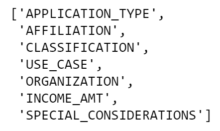

# Neural_Network_Charity_Analysis

  <a href="#">Neural Networks</a>
     
  

  
## Table of Contents
* [Overview](https://github.com/rkaysen63/Neural_Network_Charity_Analysis/blob/master/README.md#overview)
* [Resources](https://github.com/rkaysen63/Neural_Network_Charity_Analysis/blob/master/README.md#resources)
* [Results](https://github.com/rkaysen63/Neural_Network_Charity_Analysis/blob/master/README.md#results)
* [Summary](https://github.com/rkaysen63/Neural_Network_Charity_Analysis/blob/master/README.md#summary)

## Resources:    
* Data: charity_data.csv
* Tools: 
  * Python
  * Colaboratory (Colab) notebook for writing code
  * Jupyter Notebook
* https://stackoverflow.com/questions/59069058/save-model-every-10-epochs-tensorflow-keras-v2
* Opening image courtesy of: Photo by JJ Ying on Unsplash (Nice photo JJ Ying!) 
* Lesson Plan: UTA-VIRT-DATA-PT-02-2021-U-B-TTH, Module 19 Challenge

## Overview:
Alphabet Soup is a charitable foundation that has funded over 34,000 organizations over the years.  The purpose of the funding is to assist organizations with their philanthropic projects.  The data collected shows that each organization in their database has either made an impact, i.e. "IS SUCCESSFUL", or not.  The purpose of this analysis is to create a model from the existing metadata about each organization that will predict whether or not a future applicant will be successful.  In other words, the purpose is to create a model that will help Alphabet Soup determine which future applications should be accepted or rejected.

## Results:

### Deliverable 1 Requirements

  <a href="#">application_df:  Data is loaded into a DataFrame using Pandas</a>
     
  

* Drop the non-beneficial ID columns, 'EIN' and 'NAME'.   
  `application_df = application_df.drop(columns = ["EIN", "NAME"])`   

  

  
  
* Group together columns with more than 10 unique values.   

      # Determine the number of unique values in each column.    
      application_df.nunique()

  

  
  
      # Look at APPLICATION_TYPE value counts for binning.
      application_type_counts = application_df.APPLICATION_TYPE.value_counts()
      application_type_counts

  

  
        
      # Visualize the value counts of APPLICATION_TYPE.
      application_type_counts.plot.density()

  

  
        
    # Determine which values to replace if counts are less than ? (19.3.3)
    replace_application = list(application_type_counts[application_type_counts < 500].index)

    # Replace in dataframe
    for app in replace_application:
        application_df.APPLICATION_TYPE = application_df.APPLICATION_TYPE.replace(app,"Other")
    
    # Check to make sure binning was successful
    application_df.APPLICATION_TYPE.value_counts()

  

  

    # Look at CLASSIFICATION value counts for binning.
    classification_counts = application_df.CLASSIFICATION.value_counts()
    classification_counts

  

  
        
    # Visualize the value counts of CLASSIFICATION.
    classification_counts.plot.density()

  

  
        
    # Determine which values to replace if counts are less than ..? (19.3.3)
    replace_class = list(classification_counts[classification_counts < 1000].index)

    # Replace in dataframe
    for cls in replace_class:
        application_df.CLASSIFICATION = application_df.CLASSIFICATION.replace(cls,"Other")

    # Check to make sure binning was successful
    application_df.CLASSIFICATION.value_counts()

  

 

* Encode the categorical variables using one-hot encoding.   

      # Generate our categorical variable lists (19.4.2)
      application_cat = application_df.dtypes[application_df.dtypes == "object"].index.tolist()
      application_cat
      

  

 
    
    # Create a OneHotEncoder instance (19.4.3)
    enc = OneHotEncoder(sparse=False)

    # Fit and transform the OneHotEncoder using the categorical variable list
    encode_df = pd.DataFrame(enc.fit_transform(application_df[application_cat]))

    # Add the encoded variable names to the dataframe
    encode_df.columns = enc.get_feature_names(application_cat)
    encode_df.head()

  

  
  
    # Merge one-hot encoded features and drop the originals
    application_df = application_df.merge(encode_df,left_index=True, right_index=True)
    application_df = application_df.drop(application_cat,axis=1)
    application_df.head()  

  

  
  
* Split the preprocessed data into features and target arrays.   

      #  Target
      y = application_df["IS_SUCCESSFUL"].values
      # Features
      X = application_df.drop(["IS_SUCCESSFUL"],axis=1).values
    
* Split the preprocessed data into training and testing datasets.    
  `X_train, X_test, y_train, y_test = train_test_split(X, y, random_state=42)`

* Standardize the numerical values using the StandardScaler() module.    

      # Create a StandardScaler instances
      scaler = StandardScaler()

      # Fit the StandardScaler
      X_scaler = scaler.fit(X_train)

      # Scale the data
      X_train_scaled = X_scaler.transform(X_train)
      X_test_scaled = X_scaler.transform(X_test)

### Deliverable 2 Requirements

* Define the neural network model using Tensorflow Keras.   

      nn = tf.keras.models.Sequential()

      # First hidden layer
      nn.add(tf.keras.layers.Dense(units=80, activation="relu", input_dim=43))

      # Second hidden layer
      nn.add(tf.keras.layers.Dense(units=30, activation="relu"))

      # Output layer
      nn.add(tf.keras.layers.Dense(units=1, activation="sigmoid"))     

      # Check the structure of the model
      nn.summary()
  

  <a href="#">"nn" Model Structure</a>
     
  

 

* Train the model and save the model's weights every 5 epochs.

      # Import checkpoint dependencies
      import os
      from tensorflow.keras.callbacks import ModelCheckpoint, Callback

      # Define the checkpoint path and filenames
      os.makedirs("checkpoints/",exist_ok=True)
      checkpoint_path = "checkpoints/weights.{epoch:02d}.hdf5"

      # Compile the model
      nn.compile(loss="binary_crossentropy", optimizer="adam", metrics=["accuracy"])

      # Create a callback that saves the model's weights every 5 epochs

      batch_size=32
      steps_per_epoch = int(y_train.size / batch_size)
      period = 5

      cp_callback = ModelCheckpoint(
          filepath=checkpoint_path,
          verbose=1,
          save_weights_only=True,
          save_freq= period * steps_per_epoch)

      # Train the model
      fit_model = nn.fit(X_train_scaled,y_train,batch_size=32,epochs=100,callbacks=[cp_callback])

  

 

* Display output of the model's loss and accuracy.   

      # Evaluate the model using the test data
      model_loss, model_accuracy = nn.evaluate(X_test_scaled,y_test,verbose=2)
      print(f"Loss: {model_loss}, Accuracy: {model_accuracy}")

  

 

* Save results are to an HDF5 file.   

      # Export our model to HDF5 file
      nn.save("trained_application.h5")

### Deliverable 3 Requirements

* Remove noisy variables from features.  
  In the original preprocessing, ID columns 'EIN' and 'NAMES' were dropped as unnecessary. Then the DataFrame columns were checked for number of unique values, `nunique`, in order to determine whether or not to bucket some of the data.  Since both the "CLASSIFICATION" and "APPLICATION_TYPE" columns had more than 10 unique values each, their `value_counts` were were visualized in a density plot for each.  A set point for each columm was established such that any `value_counts` less than the set point would be bucketed into an "Other" category.  Even with the bucketing, model losses were 0.56 and Accuracy only 73%.  For this reason, additional preprocessing steps were taken in an attempt to boost the accuracy of the model.

  1) First the DataFrame was re-loaded and this time only 'EIN' was dropped to see if binning 'NAMES' could improve optimization.
  2) Then a variable to hold the `value_counts` of the names was created.
  
          name_counts = application_df.NAME.value_counts()
 
  3) The name_counts were plotted in a density curve.
  4) Five or less name_counts were then bucketed into an "Other" category.

          # Replace if counts are less than or equal to 5.
          replace_name = list(name_counts[name_counts <= 5].index)

          # Replace in dataframe
          for name in replace_name:
              application_df.NAME = application_df.NAME.replace(name,"Other")

          # Check to make sure binning was successful
          application_df.NAME.value_counts()

  5) "CLASSIFICATION" was binned as before.
  6) "APPLICATION_TYPE" was binned as well, but the `value_counts` set point to "Other" category was larger, thereby increasing the "Other" category from 276 to 804 `value_counts`.
  7) After reviewing the SPECIAL_CONSIDERATIONS `value_counts` for binning, I decided to drop the column since less than one percent (27/34299 * 100) of the applicants had special considerations.  

          spec_counts = application_df.SPECIAL_CONSIDERATIONS.value_counts()
          application_df = application_df.drop(columns = ["SPECIAL_CONSIDERATIONS"])
          print(application_df.shape)
          application_df.head()

  8) And finally, the categorical data was encoded as before with OneHotEncoder, merged back into the original DataFrame and the original categorical data dropped.

* Optimize the model by adding neurons to hidden layers, adding additional hidden layers, and changing the activation function of hidden or output layers.
  The newly re-preprocessed data is split into features and target arrays, then split into training and testing datasets, X_train and X_test datasets are scaled.  Before there were 43 features, but now there are 395 features.
  
      # Split our preprocessed data into our features and target arrays
      #  Target
      y = application_df["IS_SUCCESSFUL"].values
      # Features
      X = application_df.drop(["IS_SUCCESSFUL"],axis=1).values

      # Split the preprocessed data into a training and testing dataset
      X_train, X_test, y_train, y_test = train_test_split(X, y, random_state=42)

      # Create a StandardScaler instances
      scaler = StandardScaler()

      # Fit the StandardScaler
      X_scaler = scaler.fit(X_train)

      # Scale the data
      X_train_scaled = X_scaler.transform(X_train)
      X_test_scaled = X_scaler.transform(X_test)

      number_input_features = len(X_train[0])
      number_input_features
      
  Create a function to allow kerastuner to decide the number of hidden layers, number of neurons in each layer and the activation functions for each layer.

      # Create a method that creates a new Sequential model with hyperparameter options
      def create_model(hp):
          nn_model = tf.keras.models.Sequential()

          # Allow kerastuner to decide which activation function to use in hidden layers
          activation = hp.Choice('activation',['relu','tanh','sigmoid'])

          # Allow kerastuner to decide number of neurons in first layer
          nn_model.add(tf.keras.layers.Dense(units=hp.Int('first_units',
              min_value=1,
              max_value=100,
              step=2), activation=activation, input_dim=395))

          # Allow kerastuner to decide number of hidden layers and neurons in hidden layers
          for i in range(hp.Int('num_layers', 1, 6)):
              nn_model.add(tf.keras.layers.Dense(units=hp.Int('units_' + str(i),
                  min_value=1,
                  max_value=40,
                  step=2),
                  activation=activation))

          nn_model.add(tf.keras.layers.Dense(units=1, activation="sigmoid"))

          # Compile the model
          nn_model.compile(loss="binary_crossentropy", optimizer='adam', metrics=["accuracy"])

          return nn_model

      # Import the kerastuner library
      from tensorflow import keras
      import keras_tuner as kt

      tuner = kt.Hyperband(
          create_model,
          objective="val_accuracy",
          max_epochs=20,
          hyperband_iterations=2)
      # Run the kerastuner search for best hyperparameters
      tuner.search(X_train_scaled,y_train,batch_size=64,epochs=20,validation_data=(X_test_scaled,y_test))

  

 

      # Tuner results summary shows 10 best trials
      tuner.results_summary()
      
  Check the best model's structure.
  
      nn = tuner.get_best_models(num_models=1)[0]
      nn.summary()

  

 

* Compile and train the model.  Save the model's weights every 5 epochs.

      # Import checkpoint dependencies
      import os
      from tensorflow.keras.callbacks import ModelCheckpoint, Callback

      # Define the checkpoint path and filenames
      os.makedirs("checkpoints2/",exist_ok=True)
      checkpoint_path = "checkpoints2/weights.{epoch:02d}.hdf5"

      # Compile the model
      nn.compile(loss="binary_crossentropy", optimizer="adam", metrics=["accuracy"])

      # Create a callback that saves the model's weights every 5 epochs
      # https://stackoverflow.com/questions/59069058/save-model-every-10-epochs-tensorflow-keras-v2

      batch_size=32
      steps_per_epoch = int(y_train.size / batch_size)
      period = 5

      cp_callback = ModelCheckpoint(
          filepath=checkpoint_path,
          verbose=1,
          save_weights_only=True,
          save_freq= period * steps_per_epoch)

      # Train the model
      fit_model = nn.fit(X_train_scaled,y_train,batch_size=32,epochs=100,callbacks=[cp_callback])

  

 

    # Evaluate the model using the test data
    model_loss, model_accuracy = test_model.evaluate(X_test_scaled,y_test,verbose=2)
    print(f"Loss: {model_loss}, Accuracy: {model_accuracy}")
 

  

           

* Export nn model to HDF5 file.

      nn.save("AlphabetSoupCharity_Optimization.h5")

* Data Preprocessing
  * What variable(s) are considered the target(s) for your model?
  * What variable(s) are considered to be the features for your model?
  * What variable(s) are neither targets nor features, and should be removed from the input data?
* Compiling, Training, and Evaluating the Model
  * How many neurons, layers, and activation functions did you select for your neural network model, and why?
  * Were you able to achieve the target model performance?
  * What steps did you take to try and increase model performance?

## Summary:
Summarize the overall results of the deep learning model. Include a recommendation for how a different model could solve this classification problem, and explain your recommendation.

[Back to the Table of Contents](https://github.com/rkaysen63/Neural_Network_Charity_Analysis/blob/master/README.md#table-of-contents)
